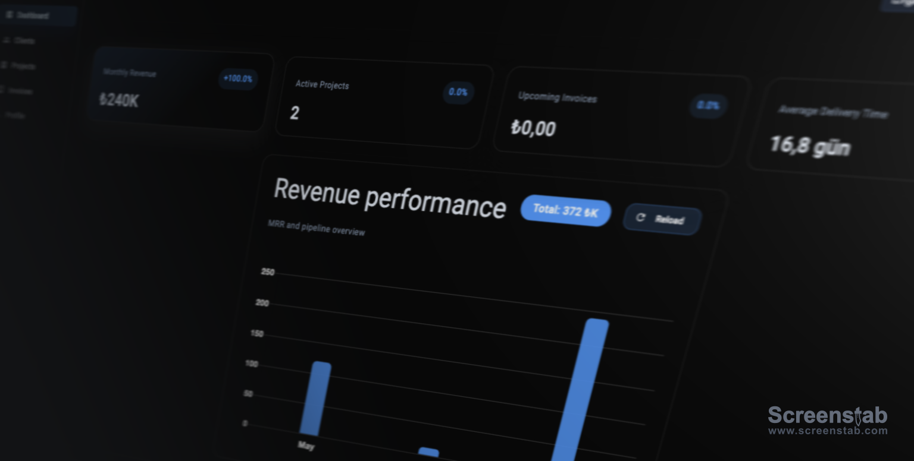
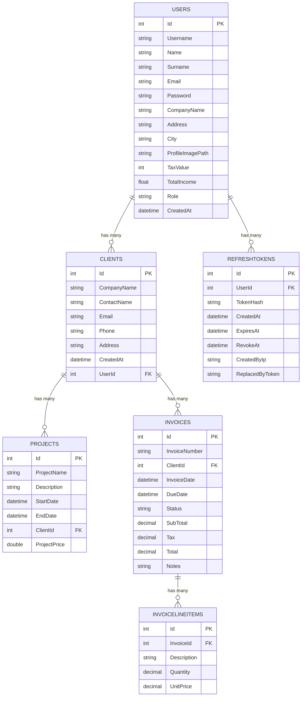

# Fivvy API (Detaylı Teknik Dokümantasyon)
 


Aşağıdaki README, proje klasöründeki kaynak kodu inceleyerek hazırlanmış genişletilmiş ve teknik odaklı bir dokümandır. Türkçe olarak mimari, konfigürasyon, çalıştırma adımları, veri modeli ve önemli tasarım kararları yer almaktadır.

## Hızlı Özet
Fivvy API, ASP.NET Core 9 üzerinde çalışan bir fatura, müşteri ve proje yönetim back-end'idir. Veri katmanı Entity Framework Core + SQLite ile, kimlik doğrulama JWT + refresh token ile sağlanır. API Swagger (OpenAPI) ile geliştirme ortamında keşfedilebilir.

Teknoloji yığını:
- .NET 9 (ASP.NET Core)
- Entity Framework Core 9 + SQLite
- JWT: Microsoft.AspNetCore.Authentication.JwtBearer + custom `JwtHelper`
- Password hashing: BCrypt
- OpenAPI/Swagger (geliştirme için)
- QuestPDF (PDF üretimi için kısmi entegrasyon)

## Proje Yapısı (kısaca)

- `Program.cs` — uygulama başlatma, servis kayıtları (DI), JWT konfigürasyonu, CORS, Swagger ve statik dosya sunucusu burada tanımlanır.
- `Data/AppDbContext.cs` — EF Core DbContext (Users, Clients, Projects, Invoices, RefreshTokens)
- `Controllers/` — REST uç noktaları (Auth, Profile, Client, Project, Invoice, Dashboard vb.)
- `Repositories/` — Veri erişim ve iş kuralları (UserRepository, ClientRepository, ProjectRepository, InvoiceRepository vb.)
- `Models/` — Entity modelleri (UserModel, ClientModel, ProjectModel, InvoiceModel, UserRefreshToken...)
- `Helpers/` — JWT üretimi/validasyonu (`JwtHelper`) ve refresh token yardımcıları (`RefreshTokenHelper`)
- `wwwroot/` — statik içerik, profile-image yüklemeleri buraya kaydedilir.

## Başlatma & Geliştirme

Ön koşullar:
- .NET 9 SDK
- dotnet-ef araçları (migrations uygulamak istiyorsanız)

Örnek geliştirme adımları:

```bash
cd backend/Fivvy.Api
dotnet restore
dotnet ef database update   # yalnızca migration'ları uygulamak istiyorsanız
dotnet run
```

Uygulama development modunda çalıştırıldığında kök (`/`) adresinde Swagger UI sunulur.

Not: CORS politikası `http://localhost:4200` (Angular frontend) için önceden yapılandırılmıştır.

## Konfigürasyon

Ana konfigürasyon dosyası: `appsettings.json`.
Öne çıkan ayarlar:

- `ConnectionStrings:DefaultConnection`: SQLite veritabanı dosyası (`Data Source=fivvy.db`).
- `JwtSettings`:
  - `Secret`: HMAC için kullanılan gizli anahtar (appsettings üzerinde örnek var).
  - `Issuer`: Token issuer değeri.
  - `Audience`: Token audience değeri.
  - `ExpiryMinutes`: Access token süresi (dakika).

Program.cs içinde JWT doğrulama parametreleri `JwtSettings`'ten okunur. Token doğrulamada `ClockSkew = TimeSpan.Zero` kullanılarak tolerans sıfırlanmıştır.

Güvenlik notu: Üretim ortamında gizli anahtarlar `appsettings.json` içinde düz metin olarak bırakılmamalı (secret manager, environment variables veya bir secret store kullanılmalı).

## Kimlik Doğrulama & Refresh Token Akışı

- Kullanıcı girişi (`POST /api/auth/login`):
  - İstek body olarak `LoginRequestModel` alır (username, password).
  - Şifre BCrypt ile doğrulanır.
  - Başarılı ise `JwtHelper.GenerateToken` ile access token oluşturulur.
  - Refresh token rastgele üretilir (`RefreshTokenHelper.CreateToken()`), veritabanında hash'lenmiş olarak saklanır (`UserRefreshToken.TokenHash`).
  - Refresh token HTTP-only cookie olarak client'a gönderilir (SameSite=None, Secure=true).

- Refresh (`POST /api/auth/refresh`):
  - Cookie'deki refresh token alınır, veritabanında hash karşılaştırmasıyla doğrulanır.
  - Yeni access token üretilir; yeni bir refresh token oluşturulur ve rotate (eski yerine yenisi) işlemi yapılır.

- Logout (`POST /api/auth/logout`):
  - Cookie içindeki refresh token veritabanında revoke edilir ve cookie silinir.

Repository tarafında refresh token'lar 7 gün için expire edilir ve birden fazla aktif token durumunda eskileri revoke edilerek `ReplacedByToken` alanı set edilir. Hash'leme için SHA256 kullanılır.

## Veri Modelleri (özet)

- UserModel
  - Id (PK), Username, Name, Surname, Email, Password (hashed), CompanyName, Address, City, ProfileImagePath, TaxValue (int, default 20), TotalIncome (float), Role (string), CreatedAt
  - Navigation: ICollection<ClientModel> Clients

- ClientModel
  - Id, CompanyName, ContactName, Email, Phone, Address, CreatedAt, UserId (foreign key), navigation: Projects, Invoices

- ProjectModel
  - Id, ProjectName, Description, StartDate, EndDate (nullable), ClientId, ProjectPrice (double)
  - NotMapped: IsActive (hesaplanan alan)

- InvoiceModel
  - Id, InvoiceNumber, ClientId, InvoiceDate, DueDate, Status (enum), LineItems, SubTotal, Tax, Total, Notes

- UserRefreshToken
  - Id, UserId, TokenHash, CreatedAt, ExpiresAt, RevokeAt, CreatedByIp, ReplacedByToken

Detaylar: modellerde JSON dönüştürücüler (`JsonConverter`) ve bazı alanlarda `[JsonIgnore]` dekoratörleri bulunur; böylece ilişkili nesneler gerektiğinde serileştirmeden hariç tutulabiliyor.

## Repository & Ownership Model

Proje, client ve invoice kaynaklarına erişim kullanıcıya (owner) bağlıdır. `JwtHelper.ValidateToken` ile ClaimTypes.NameIdentifier üzerinden userId alınıp repo'lara iletilmektedir. `UserRepository.ExtractUserIdFromToken` bu işi kolaylaştırır.

Controller'lar AuthHeaderHelper ile header içinden Bearer token'ı okumak için `AuthHeaderHelper.TryGetBearerToken(HttpContext, out var token)` kullanır. (AuthHeaderHelper proje içinde bir yardımcıdır.)

Örnek: `ClientController.GetAllClients` sadece token sahibi kullanıcının client'larını döner.

## Öne Çıkan Endpoints (özet)

- Auth
  - POST /api/auth/login — Login, dönen: access token + user özet, refresh token cookie'de.
  - POST /api/auth/register — Kayıt (şifre doğrulama kontrolü yapılır).
  - POST /api/auth/refresh — Cookie'deki refresh token ile yeni access token alınır.
  - POST /api/auth/logout — Refresh token revoke edilir ve cookie silinir.

- Profile
  - GET /api/profile/me — Kimlik doğrulama ile kullanıcı profili (clients, projects, invoices ile birlikte) döner.
  - PUT /api/profile/me/update-profile — Profil güncelleme.
  - PUT /api/profile/me/update-password — Şifre güncelleme.
  - POST /api/profile/me/upload-profile-picture — Multipart/form-data ile profil fotoğrafı yükleme.

- Clients
  - GET /api/client/clients — Kullanıcının tüm client'ları.
  - POST /api/client/add-client — Yeni client ekleme.
  - PUT /api/client/update-client — Client güncelleme.
  - DELETE /api/client/remove-client — Client silme.

- Projects
  - GET /api/project/all-projects — Kullanıcının sahip olduğu client'lara bağlı projeler.
  - POST /api/project/add-project — Proje ekleme (date/name validation & ownership kontrol repo tarafında yapılır).
  - PUT /api/project/update-project — Proje güncelleme.
  - DELETE /api/project/remove-project/{projectId} — Proje silme.

- Invoices
  - GET /api/invoice/get-all-invoices
  - GET /api/invoice/get-invoice?invoiceId=NN
  - POST /api/invoice/create-invoice
  - PUT /api/invoice/update-invoice
  - DELETE /api/invoice/delete-invoice?invoiceId=NN

Not: Bazı endpoint'ler repository tarafında iş mantığı gereği `Forbid()` veya `Unauthorized` dönebilmektedir.

## Migrations & Veritabanı

EF Core migration'ları `Migrations/` klasöründe saklanır. Var olan migrations ana hatlarıyla şunları içerir: başlangıç şeması (users, clients, projects, invoices), client-user ilişkisinin eklenmesi, createdAt alanlarının eklenmesi, refresh token tablosu, invoice modeli gibi değişiklikler.

Yeni migration eklemek veya DB'yi tekrar oluşturmak için:

```bash
cd backend/Fivvy.Api
dotnet ef migrations add <Name>
dotnet ef database update
```

## Statik Dosya Sunumu & Profil Resimleri

`Program.cs` içinde `wwwroot/profile-images` dizini `RequestPath = "/profile-images"` ile statik olarak servis edilir. Upload işlemleri `ProfileController.UploadProfilePicture` tarafından yönetilir. CORS başlıkları static file response sırasında eklenir.

## PDF Oluşturma

Projede QuestPDF kütüphanesi eklenmiş ve lisans `LicenseType.Community` olarak ayarlanmıştır. `PDFService` ve ilgili `InvoicePdfController`'lar kısmi implementasyon sağlar; tam özellikli PDF export senaryoları genişletilebilir.

## Güvenlik & Üretim Hazırlıkları (Öneriler)

- JWT Secret, connection string ve diğer hassas ayarlar environment variable veya secret manager ile yönetilmeli.
- HTTPS zorunluluğu ve CORS yapılandırması üretim ortamına göre sıkılaştırılmalı.
- Password policy (uzunluk, karmaşıklık) ve account lockout uygulanabilir.
- Refresh token süreleri, rotate ve revoke davranışı gözden geçirilmeli (ör. refresh token blacklist/cleanup cron job).

## Testler ve CI

Projede şu an otomatik test bulunmuyor. Öneri:
- xUnit + EF Core InMemory veya SQLite in-memory ile repository/integration testleri ekleyin.
- GitHub Actions veya benzeri CI ile `dotnet build`, `dotnet test` ve `dotnet ef migrations` kontrolleri çalıştırın.

## Bilinen Eksikler ve Gelecek İşler

- `PDFRepository` ve `IPDFRepository` gibi kısımlar tam implementasyon bekliyor.
- Bazı controller/repository metotlarında daha detaylı validation response objeleri (FluentValidation) eklenebilir.
- Rate limiting, logging (structured logs), ve health checks eklenmesi tavsiye edilir.

## Docker (production) — build & run

Bu depo backend ve frontend için Dockerfile'ları ve proje kökünde `docker-compose.yml` içerir; uygulamayı production modunda ayağa almak için aşağıdaki adımları kullanabilirsiniz.

Hızlı adımlar (macOS / zsh):

1. Repo kökünden servisleri derleyip başlatın:

```bash
cd /Users/olgudegirmenci/Desktop/Fivvy
docker compose build
docker compose up -d
```

2. Çalışan konteynerleri ve logları kontrol edin:

```bash
docker compose ps
docker compose logs -f backend
docker compose logs -f frontend
```

3. Uygulamalara erişin:

- Frontend: http://localhost
- Backend API: http://localhost:5000

Ortam değişkenleri & `.env` kullanımı

- Hassas veya ortama özgü değerleri repo kökünde `.env` dosyasında tutabilirsiniz; Docker Compose bu dosyayı otomatik yükler. Örnek `.env`:

```ini
JWT_SECRET=production_jwt_secret
FRONTEND_BASE_URL=http://localhost
CONNECTIONSTRINGS__DEFAULTCONNECTION=Data Source=/data/fivvy.db
```

- `docker-compose.yml` içinde backend servisi environment ile gelen değişkenleri ASP.NET konfigürasyonuna `KEY__SUBKEY` (ör. `JwtSettings__Secret`) şeklinde aktarır.

Persist ve notlar

- Compose dosyası `fivvy_db` adında bir named volume oluşturur ve backend konteyner içinde `/data`'ya mount eder; böylece SQLite DB konteyner yeniden başlasa da korunur.
- Üretimde gizli anahtarları `appsettings.json` içinde bırakmayın; environment variable, Docker secrets veya bir secret manager kullanın.

Geliştirmeler

- HTTPS/TLS sonlandırma (reverse proxy veya load balancer) ekleyin.
- CI pipeline (ör. GitHub Actions) ile image build & push otomasyonu kurun.

Kısa çalışma talimatı ve hata giderme için `DOCKER_RUN.md` dosyasına bakabilirsiniz.


## Veritabanı Mimarisi (Detaylı Şema)

Aşağıda kod tabanındaki `Models/` içeriğine dayanarak her bir tablo/entitenin sütunları, tipleri, nullability ve ilişkileri özetlenmiştir. Bu, EF Core tarafından oluşturulacak SQLite şemasının mantıksal görünümünü verir.

1) Users (UserModel)
  - Id : int (PK, Identity)
  - Username : string (NOT NULL)
  - Name : string (NOT NULL)
  - Surname : string (NOT NULL)
  - Email : string (NOT NULL)
  - Password : string (NOT NULL) — BCrypt hash saklanır
  - CompanyName : string (NULL)
  - Address : string (NULL)
  - City : string (NULL)
  - ProfileImagePath : string (NULL) — `/profile-images/...` gibi relatif URL saklanır
  - TaxValue : int NOT NULL (default 20)
  - TotalIncome : float (field, DB tipi proje konfigürasyonuna göre olur)
  - Role : string NOT NULL (default "user")
  - CreatedAt : DateTime NOT NULL (default UTC now)
  - Navigation
    - Clients : 1-to-many -> Clients.UserId

2) Clients (ClientModel)
  - Id : int (PK, Identity)
  - CompanyName : string NOT NULL
  - ContactName : string NOT NULL
  - Email : string NOT NULL (default empty string)
  - Phone : string NOT NULL (default empty string)
  - Address : string NOT NULL (default empty string)
  - CreatedAt : DateTime NOT NULL
  - UserId : int NOT NULL (FK -> Users.Id)
  - Navigation
    - User : many-to-1 -> Users
    - Projects : 1-to-many -> Projects.ClientId
    - Invoices : 1-to-many -> Invoices.ClientId

3) Projects (ProjectModel)
  - Id : int (PK, Identity)
  - ProjectName : string NOT NULL (default empty string)
  - Description : string NOT NULL (default empty string)
  - StartDate : DateTime NOT NULL
  - EndDate : DateTime NULLABLE
  - ClientId : int NOT NULL (FK -> Clients.Id)
  - ProjectPrice : double/real NOT NULL
  - Computed (NotMapped)
    - IsActive : boolean hesaplanır (EndDate == null veya EndDate >= now)
  - Navigation
    - Client : many-to-1 -> Clients

4) Invoices (InvoiceModel)
  - Id : int (PK, Identity)
  - InvoiceNumber : string NULL
  - ClientId : int NOT NULL (FK -> Clients.Id)
  - InvoiceDate : DateTime NOT NULL
  - DueDate : DateTime NOT NULL
  - Status : enum (Unapproved, Approved) — DB tarafında tip olarak int ya da string (JsonConverter sadece serialization için)
  - SubTotal : decimal NOT NULL
  - Tax : decimal NOT NULL
  - Total : decimal NOT NULL
  - Notes : string NULL
  - Navigation
    - Client : many-to-1 -> Clients
    - LineItems : 1-to-many (InvoiceLineItemModel) — LineItem.InvoiceId

5) InvoiceLineItems (InvoiceLineItemModel)
  - Id : int (PK)
  - InvoiceId : int NOT NULL (FK -> Invoices.Id)
  - Description : string NOT NULL
  - Quantity : decimal NOT NULL
  - UnitPrice : decimal NOT NULL
  - Total : decimal (hesaplanan) => Quantity * UnitPrice (Not mapped to DB as computed property)
  - Navigation
    - Invoice : many-to-1 -> Invoices

6) RefreshTokens (UserRefreshToken)
  - Id : int (PK, Identity)
  - UserId : int NOT NULL (FK -> Users.Id)
  - TokenHash : string NOT NULL (SHA256 hashed refresh token)
  - CreatedAt : DateTime NOT NULL
  - ExpiresAt : DateTime NOT NULL
  - RevokeAt : DateTime NULLABLE
  - CreatedByIp : string NULLABLE
  - ReplacedByToken : string NULLABLE
  - Navigation
    - User : many-to-1 -> Users

7) Admin / Dashboard DTO'ları
  - Admin ile ilgili modeller (`AdminDashboardModel`, `AdminUserListItemModel`, `EntityTotalsModel`, `RoleDistributionModel`, `UserSummaryModel`) veritabanı tabloları değildir; yalnızca API tarafından döndürülen DTO'lardır (agregasyon sonuçları). Bu modeller tipik olarak repository tarafında LINQ sorgularıyla doldurulur.

8) Activity / Dashboard DTO'ları
  - `ActivityModel`, `ActivityItemModel`, `DashboardModel` vb. yine DB tablosu olarak değil, API response / UI model'leri olarak kullanılır.


