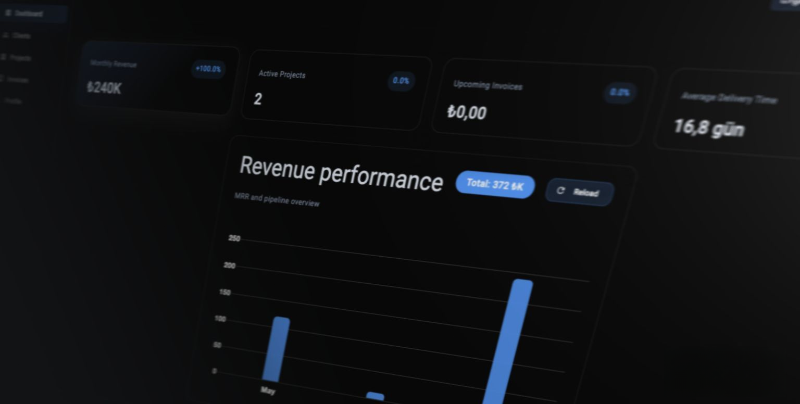

# Fivvy API (Detailed Technical Documentation)
 


The following README is an expanded, technically focused document prepared by reviewing the source code in the project folder. It covers the architecture, configuration, execution steps, data model, and key design decisions in Turkish.

## Quick Summary
Fivvy API is a billing, customer, and project management back-end running on ASP.NET Core 9. The data layer uses Entity Framework Core + SQLite, while authentication is provided by JWT + refresh token. The API can be explored in the development environment using Swagger (OpenAPI).


Technology stack:
- .NET 9 (ASP.NET Core)
- Entity Framework Core 9 + SQLite
- JWT: Microsoft.AspNetCore.Authentication.JwtBearer + custom `JwtHelper`
- Password hashing: BCrypt
- OpenAPI/Swagger (for development)
- QuestPDF (partial integration for PDF generation)

## Project Structure (briefly)

- `Program.cs` — application startup, service registrations (DI), JWT configuration, CORS, Swagger, and static file server are defined here.
- `Data/AppDbContext.cs` — EF Core DbContext (Users, Clients, Projects, Invoices, RefreshTokens)
- `Controllers/` — REST endpoints (Auth, Profile, Client, Project, Invoice, Dashboard, etc.)
- `Repositories/` — Data access and business logic (UserRepository, ClientRepository, ProjectRepository, InvoiceRepository, etc.)
- `Models/` — Entity models (UserModel, ClientModel, ProjectModel, InvoiceModel, UserRefreshToken...)
- `Helpers/` — JWT generation/validation (`JwtHelper`) and refresh token helpers (`RefreshTokenHelper`)
- `wwwroot/` — Static content, profile image uploads are stored here.


## Getting Started & Development

Prerequisites:
- .NET 9 SDK
- dotnet-ef tools (if you want to apply migrations)

Sample development steps:

```bash
cd backend/Fivvy.Api
dotnet restore
dotnet ef database update   # just if you want to apply migrations
dotnet run
```

When running in application development mode, Swagger UI is served at the root (`/`) address.

Note: The CORS policy is preconfigured for `http://localhost:4200` (Angular frontend).

## Configuration

Main configuration file: `appsettings.json`.
Notable settings:

- `ConnectionStrings:DefaultConnection`: SQLite database file (`Data Source=fivvy.db`).
- `JwtSettings`:
  - `Secret`: Secret key used for HMAC (example available in appsettings).
  - `Issuer`: Token issuer value.
  - `Audience`: Token audience value.
  - `ExpiryMinutes`: Access token duration (minutes).

The JWT verification parameters are read from `JwtSettings` in Program.cs. The tolerance is set to zero by using `ClockSkew = TimeSpan.Zero` in token verification.

Security note: In production environments, secret keys should not be left in plain text in `appsettings.json` (a secret manager, environment variables, or a secret store should be used).

## Identity Verification & Refresh Token Flow

- User login (`POST /api/auth/login`):
  - The request body receives `LoginRequestModel` (username, password).
  - The password is verified with BCrypt.
  - If successful, an access token is created with `JwtHelper.GenerateToken`.
  - The refresh token is randomly generated (`RefreshTokenHelper.CreateToken()`) and stored in the database as a hash (`UserRefreshToken.TokenHash`).
  - The refresh token is sent to the client as an HTTP-only cookie (SameSite=None, Secure=true).

- Refresh (`POST /api/auth/refresh`):
  - The refresh token in the cookie is retrieved and verified by comparing the hash in the database.
  - A new access token is generated; a new refresh token is created and rotated (the new one replaces the old one).

- Logout (`POST /api/auth/logout`):
  - The refresh token in the cookie is revoked in the database and the cookie is deleted.

On the repository side, refresh tokens expire after 7 days, and if there are multiple active tokens, the old ones are revoked and the `ReplacedByToken` field is set. SHA256 is used for hashing.

## Data Models (summary)

- UserModel
  - Id (PK), Username, Name, Surname, Email, Password (hashed), CompanyName, Address, City, ProfileImagePath, TaxValue (int, default 20), TotalIncome (float), Role (string), CreatedAt
  - Navigation: ICollection<ClientModel> Clients

- ClientModel
  - Id, CompanyName, ContactName, Email, Phone, Address, CreatedAt, UserId (foreign key), navigation: Projects, Invoices

- ProjectModel
  - Id, ProjectName, Description, StartDate, EndDate (nullable), ClientId, ProjectPrice (double)
  - NotMapped: IsActive (hesaplanan alan)

- InvoiceModel
  - Id, InvoiceNumber, ClientId, InvoiceDate, DueDate, Status (enum), LineItems, SubTotal, Tax, Total, Notes

- UserRefreshToken
  - Id, UserId, TokenHash, CreatedAt, ExpiresAt, RevokeAt, CreatedByIp, ReplacedByToken

Details: Models contain JSON converters (`JsonConverter`) and `[JsonIgnore]` decorators in certain fields; this allows related objects to be excluded from serialization when necessary.

## Repository & Ownership Model

Access to project, client, and invoice resources is dependent on the user (owner). The userId is retrieved via ClaimTypes.NameIdentifier using `JwtHelper.ValidateToken` and passed to the repositories. `UserRepository.ExtractUserIdFromToken` simplifies this task.

Controllers use `AuthHeaderHelper.TryGetBearerToken(HttpContext, out var token)` with AuthHeaderHelper to read the Bearer token from the header. (AuthHeaderHelper is a helper within the project.)

Example: `ClientController.GetAllClients` only returns the clients of the token holder.

## Featured Endpoints (summary)

- Auth
  - POST /api/auth/login — Login, returns: access token + user summary, refresh token in cookie.
  - POST /api/auth/register — Registration (password validation check performed).
  - POST /api/auth/refresh — New access token obtained using refresh token in cookie.
  - POST /api/auth/logout — Revokes the refresh token and deletes the cookie.

- Profile
  - GET /api/profile/me — Returns the user profile (along with clients, projects, invoices) with authentication.
  - PUT /api/profile/me/update-profile — Profile update.
  - PUT /api/profile/me/update-password — Password update.
  - POST /api/profile/me/upload-profile-picture — Upload profile picture with multipart/form-data.

- Clients
  - GET /api/client/clients — All clients of the user.
  - POST /api/client/add-client — Add a new client.
  - PUT /api/client/update-client — Update a client.
  - DELETE /api/client/remove-client — Delete a client.

- Projects
  - GET /api/project/all-projects — Projects associated with the user's clients.
  - POST /api/project/add-project — Add a project (date/name validation & ownership check performed on the repo side).
  - PUT /api/project/update-project — Update a project.
  - DELETE /api/project/remove-project/{projectId} — Delete project.

- Invoices
  - GET /api/invoice/get-all-invoices
  - GET /api/invoice/get-invoice?invoiceId=NN
  - POST /api/invoice/create-invoice
  - PUT /api/invoice/update-invoice
  - DELETE /api/invoice/delete-invoice?invoiceId=NN

Note: Some endpoints may return `Forbid()` or `Unauthorized` due to business logic on the repository side.

## Migrations & Database

EF Core migrations are stored in the `Migrations/` folder. Existing migrations broadly include: the initial schema (users, clients, projects, invoices), adding the client-user relationship, adding createdAt fields, the refresh token table, changes to the invoice model, and so on.

To add a new migration or rebuild the DB:

```bash
cd backend/Fivvy.Api
dotnet ef migrations add <Name>
dotnet ef database update
```

## Static File Serving & Profile Images

The `wwwroot/profile-images` directory is served statically via `RequestPath = “/profile-images”` in `Program.cs`. Upload operations are managed by `ProfileController.UploadProfilePicture`. CORS headers are added during static file responses.

## PDF Generation

The QuestPDF library has been added to the project and the license is set to `LicenseType.Community`. `PDFService` and related `InvoicePdfController`s provide partial implementation; fully featured PDF export scenarios can be extended.

## Security & Production Readiness (Recommendations)

- JWT Secret, connection string, and other sensitive settings should be managed via environment variables or a secret manager.
- HTTPS requirement and CORS configuration should be tightened according to the production environment.
- Password policy (length, complexity) and account lockout can be implemented.
- Refresh token durations, rotation, and revocation behavior should be reviewed (e.g., refresh token blacklist/cleanup cron job).

## Tests and CI

There are currently no automated tests in the project. Suggestion:
- Add repository/integration tests using xUnit + EF Core InMemory or SQLite in-memory.
- Run `dotnet build`, `dotnet test`, and `dotnet ef migrations` checks using GitHub Actions or similar CI.

## Known Issues and Future Tasks

## Docker (production) — build & run

This repository includes Dockerfiles for the backend and frontend plus a `docker-compose.yml` at the project root to run the application in production mode.

Quick steps (macOS / zsh):

1. From the repo root, build and start services:

```bash
cd /Users/olgudegirmenci/Desktop/Fivvy
docker compose build
docker compose up -d
```

2. Check running containers and logs:

```bash
docker compose ps
docker compose logs -f backend
docker compose logs -f frontend
```

3. Open the apps:

- Frontend: http://localhost
- Backend API: http://localhost:5000

Environment variables & .env usage

- You can store sensitive or environment-specific values in a `.env` file at the repo root and Docker Compose will load them automatically. Example `.env` entries:

```ini
JWT_SECRET=your_production_jwt_secret_here
FRONTEND_BASE_URL=http://localhost
# Overrides the backend connection string used inside the container
CONNECTIONSTRINGS__DEFAULTCONNECTION=Data Source=/data/fivvy.db
```

- In `docker-compose.yml` the backend service reads environment variables using the `KEY__SUBKEY` convention (for nested config like `ConnectionStrings:DefaultConnection` or `JwtSettings:Secret`). For example `JwtSettings__Secret` will map to `JwtSettings:Secret` in ASP.NET configuration.

Persistence & notes

- The compose file creates a named Docker volume (`fivvy_db`) and mounts it at `/data` inside the backend container; the backend connection string points at `/data/fivvy.db` so the SQLite DB persists across container restarts.
- For production, do not keep secrets in `appsettings.json`. Prefer environment variables, Docker secrets, or a secret manager.

Further improvements

- Add HTTPS / TLS termination (reverse proxy or load balancer) and configure nginx or Traefik as needed.
- Consider CI pipeline to build and push images (GitHub Actions, etc.).

See `DOCKER_RUN.md` for a short runbook and troubleshooting tips.
- Adding rate limiting, logging (structured logs), and health checks is recommended.

## Database Architecture (Detailed Schema)

Below is a summary of the columns, types, nullability, and relationships for each table/entity based on the `Models/` content in the codebase. This provides a logical view of the SQLite schema that will be created by EF Core.

1) Users (UserModel)
  - Id : int (PK, Identity)
  - Username : string (NOT NULL)
  - Name : string (NOT NULL)
  - Surname : string (NOT NULL)
  - Email : string (NOT NULL)
  - Password : string (NOT NULL) — BCrypt hash saklanır
  - CompanyName : string (NULL)
  - Address : string (NULL)
  - City : string (NULL)
  - ProfileImagePath : string (NULL) — `/profile-images/...` gibi relatif URL saklanır
  - TaxValue : int NOT NULL (default 20)
  - TotalIncome : float (field, DB tipi proje konfigürasyonuna göre olur)
  - Role : string NOT NULL (default "user")
  - CreatedAt : DateTime NOT NULL (default UTC now)
  - Navigation
    - Clients : 1-to-many -> Clients.UserId

2) Clients (ClientModel)
  - Id : int (PK, Identity)
  - CompanyName : string NOT NULL
  - ContactName : string NOT NULL
  - Email : string NOT NULL (default empty string)
  - Phone : string NOT NULL (default empty string)
  - Address : string NOT NULL (default empty string)
  - CreatedAt : DateTime NOT NULL
  - UserId : int NOT NULL (FK -> Users.Id)
  - Navigation
    - User : many-to-1 -> Users
    - Projects : 1-to-many -> Projects.ClientId
    - Invoices : 1-to-many -> Invoices.ClientId

3) Projects (ProjectModel)
  - Id : int (PK, Identity)
  - ProjectName : string NOT NULL (default empty string)
  - Description : string NOT NULL (default empty string)
  - StartDate : DateTime NOT NULL
  - EndDate : DateTime NULLABLE
  - ClientId : int NOT NULL (FK -> Clients.Id)
  - ProjectPrice : double/real NOT NULL
  - Computed (NotMapped)
    - IsActive : boolean hesaplanır (EndDate == null veya EndDate >= now)
  - Navigation
    - Client : many-to-1 -> Clients

4) Invoices (InvoiceModel)
  - Id : int (PK, Identity)
  - InvoiceNumber : string NULL
  - ClientId : int NOT NULL (FK -> Clients.Id)
  - InvoiceDate : DateTime NOT NULL
  - DueDate : DateTime NOT NULL
  - Status : enum (Unapproved, Approved) — DB tarafında tip olarak int ya da string (JsonConverter sadece serialization için)
  - SubTotal : decimal NOT NULL
  - Tax : decimal NOT NULL
  - Total : decimal NOT NULL
  - Notes : string NULL
  - Navigation
    - Client : many-to-1 -> Clients
    - LineItems : 1-to-many (InvoiceLineItemModel) — LineItem.InvoiceId

5) InvoiceLineItems (InvoiceLineItemModel)
  - Id : int (PK)
  - InvoiceId : int NOT NULL (FK -> Invoices.Id)
  - Description : string NOT NULL
  - Quantity : decimal NOT NULL
  - UnitPrice : decimal NOT NULL
  - Total : decimal (hesaplanan) => Quantity * UnitPrice (Not mapped to DB as computed property)
  - Navigation
    - Invoice : many-to-1 -> Invoices

6) RefreshTokens (UserRefreshToken)
  - Id : int (PK, Identity)
  - UserId : int NOT NULL (FK -> Users.Id)
  - TokenHash : string NOT NULL (SHA256 hashed refresh token)
  - CreatedAt : DateTime NOT NULL
  - ExpiresAt : DateTime NOT NULL
  - RevokeAt : DateTime NULLABLE
  - CreatedByIp : string NULLABLE
  - ReplacedByToken : string NULLABLE
  - Navigation
    - User : many-to-1 -> Users

7) Admin / Dashboard DTOs
  - Admin-related models (`AdminDashboardModel`, `AdminUserListItemModel`, `EntityTotalsModel`, `RoleDistributionModel`, `UserSummaryModel`) are not database tables; they are only DTOs returned by the API (aggregation results). These models are typically populated on the repository side using LINQ queries.

8) Activity / Dashboard DTOs
  - `ActivityModel`, `ActivityItemModel`, `DashboardModel`, etc. are also used as API response / UI models, not as database tables.


